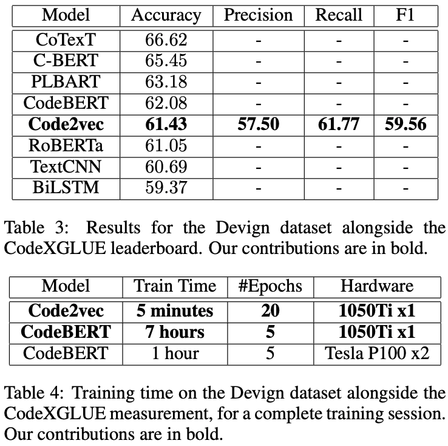

# Code2vec

**Abstract:** This paper presents an evaluation of the code
representation model Code2vec when trained on
the task of detecting security vulnerabilities in
C source code. We leverage the open-source library astminer to extract path-contexts from the
abstract syntax trees of a corpus of labeled C
functions. Code2vec is trained on the resulting
path-contexts with the task of classifying a function as vulnerable or non-vulnerable. Using the
CodeXGLUE benchmark, we show that the accuracy of Code2vec for this task is comparable
to simple transformer-based methods such as pretrained RoBERTa, and outperforms more naive
NLP-based methods. We achieved an accuracy
of 61.43% while maintaining low computational
requirements relative to larger models.

 

    

         

            
         

        

            
         

    

 

**(2021)** David Coimbra, Sofia Reis, Rui Abreu, Corina Păsăreanu, Hakan Erdogmus. "On using distributed representations of source code for the detection of C security vulnerabilities". Published at the *International Workshop on Principles of Diagnosis* ([DX'21](https://www.hsu-hh.de/imb/en/dx-2021))
 📄 Paper: [https://arxiv.org/pdf/2106.01367.pdf](https://arxiv.org/pdf/2106.01367.pdf). 🎖 CodeXGLUE [Leaderboard](https://microsoft.github.io/CodeXGLUE/) - Defect Detection